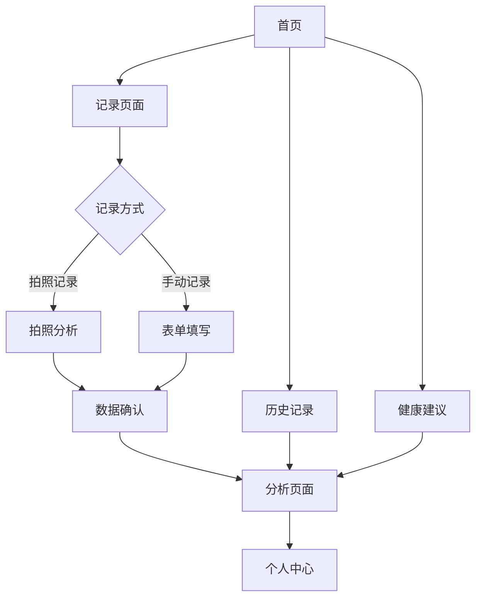

## 1. 产品概述

大便健康记录分析平台是一个专注于通过科学记录和分析大便数据来评估肠道及身体健康状况的专业健康管理工具。用户可以通过简单的日常记录，获得个性化的健康分析和建议。

- 解决肠道健康问题难以量化追踪的痛点
- 目标用户：关注肠道健康的个人用户、健康管理师、营养师
- 通过数据可视化帮助用户了解身体状况，及时发现健康异常

## 2. 核心功能

### 2.1 用户角色

| 角色 | 注册方式 | 核心权限 |
|------|----------|----------|
| 普通用户 | 邮箱/手机号注册 | 记录个人数据、查看分析报告、基础健康建议 |
| 高级用户 | 付费升级 | 高级分析功能、专业报告导出、营养师咨询 |
| 管理员 | 内部创建 | 用户管理、数据分析、系统配置 |

### 2.2 功能模块

平台包含以下核心页面：
1. **首页**：健康概览、快速记录入口、最近记录展示
2. **记录页面**：大便记录表单、历史记录列表、数据编辑
3. **分析页面**：健康趋势图表、异常提醒、个性化建议
4. **个人中心**：用户信息、设置、数据导出、隐私管理
5. **登录注册页面**：用户认证、密码重置、第三方登录

### 2.3 页面详情

| 页面名称 | 模块名称 | 功能描述 |
|----------|----------|----------|
| 首页 | 健康概览面板 | 显示最近7天健康评分、异常提醒数量、记录完成度 |
| 首页 | 快速记录入口 | 一键进入记录页面，支持拍照和手动输入两种方式 |
| 首页 | 最近记录展示 | 卡片式展示最近3次记录，包含时间、评分、关键指标 |
| 记录页面 | 大便记录表单 | 记录颜色、形状、频率、气味、伴随症状等12项指标 |
| 记录页面 | 拍照记录功能 | 支持大便照片拍摄和自动分析（可选） |
| 记录页面 | 历史记录列表 | 按时间倒序展示所有记录，支持筛选和搜索 |
| 分析页面 | 健康趋势图表 | 7天、30天、90天的多维度健康趋势可视化 |
| 分析页面 | 异常提醒系统 | 基于记录数据自动识别异常并推送提醒 |
| 分析页面 | 个性化建议 | 根据分析结果提供饮食、作息、运动建议 |
| 个人中心 | 用户信息管理 | 头像、昵称、性别、年龄、身高体重等基础信息 |
| 个人中心 | 隐私设置 | 数据可见性、删除账户、数据导出权限控制 |
| 个人中心 | 数据导出 | 支持PDF报告、Excel数据表导出 |
| 登录注册页面 | 用户认证 | 邮箱/手机号登录、密码强度验证、记住登录状态 |
| 登录注册页面 | 第三方登录 | 支持微信、Apple ID等快捷登录方式 |

## 3. 核心流程

### 普通用户流程
1. 用户注册/登录 → 2. 完善基础信息 → 3. 开始记录大便数据 → 4. 查看健康分析 → 5. 获得改善建议 → 6. 持续记录追踪

### 数据记录流程
快速记录 → 选择记录方式（拍照/手动）→ 填写各项指标 → 确认提交 → 即时分析反馈

## 4. 用户界面设计

### 4.1 设计风格
- **主色调**：健康绿（#4CAF50）搭配白色背景，营造专业健康感
- **辅助色**：温暖的橙色（#FF9800）用于重要提醒和按钮
- **按钮样式**：圆角矩形，3D阴影效果，悬停状态明显
- **字体选择**：思源黑体为主，14-16px正文，18-20px标题
- **布局风格**：卡片式布局，顶部导航栏，底部标签栏（移动端）
- **图标风格**：线性图标，简洁现代，使用健康相关的隐喻图标

### 4.2 页面设计概览

| 页面名称 | 模块名称 | UI元素 |
|----------|----------|--------|
| 首页 | 健康概览面板 | 圆形进度条显示健康评分，渐变色彩，动态数字效果 |
| 首页 | 快速记录入口 | 大型悬浮按钮，绿色渐变背景，相机图标突出 |
| 记录页面 | 大便记录表单 | 分组卡片布局，颜色选择器使用圆形色块，形状使用图标化选择 |
| 分析页面 | 健康趋势图表 | 折线图和柱状图结合，支持手势缩放，颜色编码健康等级 |
| 个人中心 | 用户信息管理 | 圆形头像，简洁表单，实时保存提示 |

### 4.3 响应式设计
- **移动端优先**：针对手机屏幕优化，单手操作友好
- **平板适配**：横竖屏自适应，利用大屏幕展示更多图表
- **桌面端支持**：最大1200px宽度限制，左右留白提升阅读体验
- **触摸优化**：按钮最小44px触摸区域，支持滑动手势操作

## 5. 验收标准（Acceptance Criteria）

### 5.1 数据记录系统
- 记录必须包含：时间戳（到分钟）、Bristol类型（1-7）、气味强度（1-5）、颜色（标准色卡）、排便量（小/中/大）、伴随症状（多选）、备注
- 前端在离线状态下可完成记录；恢复网络后可一键同步队列到服务端
- 服务端成功持久化，每条记录包含创建与更新时间、版本号；接口返回201
- 备注加密开启时，发送内容为AES-GCM加密包，包含`enc/alg/iv/data`

### 5.2 数据分析与预警
- 趋势图支持周/月/季度视图；数据点数量与服务端统计一致
- 连续≥3天未记录触发便秘预警；连续≥3天Bristol≥6触发腹泻预警
- 健康评分范围0-100，计算考虑频率稳定性、Bristol中位偏离、气味均值

### 5.3 用户账户与同步
- 支持注册与登录，登录后请求携带JWT；未登录走`x-user-id`兼容头
- 支持端到端加密开关；加密口令本地派生，不发送到服务端
- 多设备同步：同一用户ID下数据可聚合展示，冲突保留快照（后续增强）

### 5.4 技术与扩展
- PWA安装与离线可用；IndexedDB记录与队列表存在
- RESTful API返回语义化状态码与JSON结构
- 预留FHIR与微信小程序接口占位（后续迭代）

### 5.5 质量指标
- 核心后端模块单元测试覆盖率≥90%（行/分支覆盖）
- 关键流程端到端测试通过：记录→分析→预警→导出/删除
- 安全基线：TLS传输、字段级加密（备注）、JWT过期与校验

## 6. 项目计划与时间表（里程碑）

- Sprint 1（2周）：项目脚手架、认证登陆、记录表单与IndexedDB离线写入、Entries CRUD、PRD与技术文档定稿
- Sprint 2（2周）：趋势图与健康评分v1、预警触发与通知、服务端分析接口、单元测试覆盖核心≥90%
- Sprint 3（2周）：端到端加密（可选开关）、冲突解决基础、隐私导出/删除、饮食关联v1
- Sprint 4（2周）：响应式与UI/UX完善、端到端集成测试、性能与安全测试
- Sprint 5（1周）：CI/CD流水线、运维手册、预发布验证与优化

每个Sprint结束需完成阶段交付与质量评审，满足验收标准后进入下一阶段。
